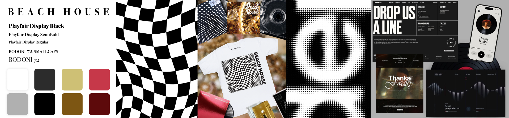
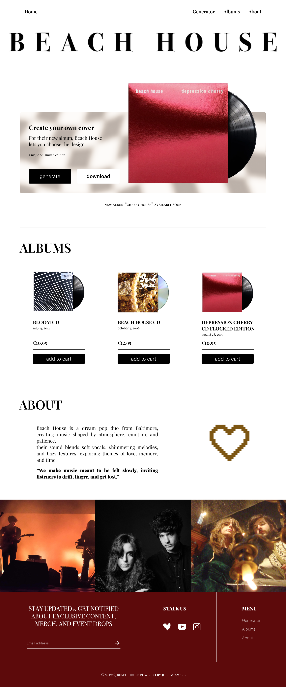

# Personalized Album cover generator
## The project's goal
This project was born from one passion : music.
We wanted to allow fans to customise the album covers of their favourite artists as a way to feel closer to them.

    The first artist we chose to create album covers for is Beach House.

## Beach House
> **Beach House** is a indie rock / dream pop french-american band.
Their style is at times **minimalistic** but also quite eclectic.
The covers of their album often varies beetween geometric shapes, plain colors or photomontages.

## Art style
We decided to focus on the core of Beach House's artistic direction : Something **geometric**, **simple** and that has a certain **"rock" soul**.

    Checkered or geometric patterns, black, red and golden colors, simple squeletton : 
    these are what we used to create Beach House's new website and covers.


*stylescape*

*maquette*

# Prerequisites 
Our project is made using *vite*, *typescript* and basic *css*.

To launch the project, use :
```
npm i
npm run dev
```
***NB***:each timme you refresh, the cover changes ! 

